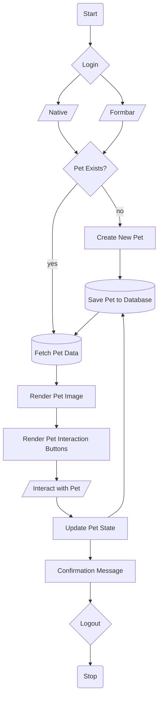

```mermaid
flowchart TD
%% Nodes
    Start --> A
    A --> B
    A --> C
    B --> D
    C --> D
    D -->|no| E
    E --> F
    D -->|yes| G
    F --> G
    G --> H
    H --> I
    I --> J
    J --> K
    K --> L
    K --> F
    L --> M
    M --> Stop

%% Node Labels
    Start(Start)
    A{Login}
    B[/Native/]
    C[/Formbar/]
    D{Pet Exists?}
    E[Create New Pet]
    F[(Save Pet to Database)]
    G[(Fetch Pet Data)]
    H[Render Pet Image]
    I[Render Pet Interaction Buttons]
    J[/Interact with Pet/]
    K[Update Pet State]
    L[Confirmation Message]
    M{Logout}
    Stop(Stop)

```